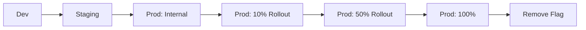

# TZAHU CRM — Release Plan

> **Version:** 0.1.0-draft
> **Last Updated:** 2026-07-27
> **Status:** Approved
> **Owner:** Platform Architecture Team

---

## Table of Contents

1. [Release Cadence](#1-release-cadence)
2. [Versioning Strategy](#2-versioning-strategy)
3. [Release Process](#3-release-process)
4. [Release Criteria](#4-release-criteria)
5. [Rollback Plan](#5-rollback-plan)
6. [Feature Flags](#6-feature-flags)
7. [Release Calendar (R1-R4)](#7-release-calendar-r1-r4)
8. [Hotfix Process](#8-hotfix-process)
9. [Changelog & Communication](#9-changelog--communication)

---

## 1. Release Cadence

| Release Type | Frequency | Scope | Timeline |
|-------------|-----------|-------|----------|
| Major (X.0) | Monthly | New features, breaking API changes, architectural changes | 4-week cycle |
| Minor (x.Y) | Bi-weekly | Features, improvements, non-breaking API additions | 2-week cycle |
| Patch (x.y.Z) | As needed | Bug fixes, security patches, critical hotfixes | Same day |
| Hotfix | Emergency | P0/P1 production issues | Within hours |

### Release Day: Tuesday
- Code freeze: Friday EOD before release week.
- Staging deployment: Monday.
- Production deployment: Tuesday 10:00 AM UTC.
- Monitoring period: 48 hours post-deployment.

---

## 2. Versioning Strategy

### Semantic Versioning

```
v{major}.{minor}.{patch}
```

| Component | Version | Example | Notes |
|-----------|---------|---------|-------|
| Backend API | v1.3.0 | Matches API version + release |
| Frontend | v1.3.0 | Matches backend release |
| API Contract | v1 | Changes only on major API changes |
| Documentation | Latest | Updated per release |
| Docker Images | {sha} | Git commit hash |

### Version Alignment

```yaml
# All aligned to the same release number
backend/pyproject.toml: version = "0.2.0"
frontend/package.json: version = "0.2.0"
ai_gateway/pyproject.toml: version = "0.2.0"
docs/schema.yml: info.version = "0.2.0"
```

### Breaking vs. Non-Breaking

**Major version bump (v1 → v2):**
- API endpoint removal or rename.
- Request/response field removal or type change.
- Authentication mechanism change.
- Database schema changes requiring data migration.

**Minor version bump (v1.2 → v1.3):**
- New API endpoints.
- New optional fields in requests/responses.
- New query parameters.
- New features behind feature flags.

**Patch version bump (v1.2.3 → v1.2.4):**
- Bug fixes.
- Security patches.
- Performance improvements.
- Dependency updates.

---

## 3. Release Process

### Phase 1: Code Freeze (Friday, T-4 days)

```
Day -4 (Friday) - Code Freeze
  - All feature branches merged to main by EOD.
  - No new features accepted until after release.
  - Critical bug fixes only (P0/P1).

Day -3 (Monday) - Staging Deployment
  - CI/CD deploys latest main to staging.
  - Smoke tests run automatically.
  - QA team begins regression testing.

Day -2 (Tuesday) - Pre-Production Validation
  - QA completes regression testing.
  - Performance benchmarks verified.
  - Security scan completed.
  - Release candidate tagged (v1.2.3-rc1).

Day -1 (Wednesday) - Release Approval
  - Release manager reviews test results.
  - Product owner signs off.
  - Change log finalized.
  - Release notes published internally.

Day 0 (Thursday) - Production Deployment
  - 09:00 UTC: Final health check.
  - 09:30 UTC: Database migrations (Phase 1).
  - 10:00 UTC: Rolling update starts.
  - 10:30 UTC: Smoke tests pass.
  - 11:00 UTC: Monitoring period begins.
  - 14:00 UTC: Release declared successful.
```

### Release Checklist

```markdown
## Release v1.2.3 Checklist

### Pre-Release
- [ ] All features merged to main
- [ ] All tests pass (unit, integration, isolation, security)
- [ ] Coverage >= 90%
- [ ] Performance benchmarks meet targets
- [ ] No P0/P1 bugs open
- [ ] Security review passed
- [ ] OpenAPI schema generated and committed
- [ ] Changelog updated
- [ ] Release notes written
- [ ] Migration scripts tested forward AND backward
- [ ] Feature flags configured

### Staging Deployment
- [ ] Deployed to staging
- [ ] Smoke tests pass
- [ ] E2E tests pass
- [ ] Regression tests pass (QA)
- [ ] Performance benchmarks pass
- [ ] Tenant isolation tests pass

### Production Deployment
- [ ] Database migration executed
- [ ] Backend rolling update complete
- [ ] Celery workers restarted
- [ ] Frontend deployed
- [ ] AI Gateway deployed
- [ ] Smoke tests pass
- [ ] Error rate stable (< 0.1%)
- [ ] p95 latency stable (< 500ms)
- [ ] Monitoring dashboards green

### Post-Release
- [ ] Release tagged in git
- [ ] Release notes published
- [ ] Stakeholders notified
- [ ] Post-mortem scheduled (if needed)
```

---

## 4. Release Criteria

### Mandatory Gates

| Gate | Requirement | Owner |
|------|-------------|-------|
| Unit tests | All pass, coverage >= 90% | Engineering |
| Integration tests | All pass | Engineering |
| Tenant isolation tests | 100% pass | Engineering |
| Security tests | No high/critical findings | Security team |
| Contract tests | No schema drift | Engineering |
| Performance tests | p95 < 500ms API, < 5s AI | Engineering |
| E2E tests | Critical flows pass | QA |
| Regression tests | No regressions in existing features | QA |
| Security review | No new vulnerabilities | Security team |
| Code review | All changes reviewed | Engineering |
| Documentation | Updated for new features | Engineering + Docs |
| Changelog | Updated with all changes | Engineering |

### Quality Gates by Release Type

| Criteria | Major | Minor | Patch | Hotfix |
|----------|-------|-------|-------|--------|
| Full test suite | Required | Required | Required | Required |
| Security review | Required | Required | Optional | Optional |
| Performance benchmarks | Required | Required | Optional | Not required |
| E2E tests | Required | Required | Required | Skip |
| Regression (full) | Required | Required | Skip | Skip |
| Regression (critical) | Required | Required | Required | Required |
| Documentation | Required | Required | Skip | Skip |
| Stakeholder demo | Required | Optional | Skip | Skip |
| Staging soak (48h) | Required | Required | Skip | Skip |
| Approval gate | Engineering + Product + Security | Engineering + Product | Engineering | Engineering Lead |

---

## 5. Rollback Plan

### Immediate Rollback Triggers

| Condition | Action | Owner |
|-----------|--------|-------|
| Error rate > 1% for 5 min | Rollback to previous version | On-call engineer |
| p95 latency > 2x baseline for 10 min | Rollback to previous version | On-call engineer |
| Tenant isolation breach detected | Rollback + immediate investigation | Security + Engineering |
| Data corruption detected | Rollback + DB restore | Engineering + DBA |
| Auth system failure | Rollback + cross-team escalation | Engineering |

### Rollback Steps

```bash
# Step 1: Revert backend
kubectl rollout undo deployment/backend --namespace=backend
kubectl rollout status deployment/backend --namespace=backend --timeout=5m

# Step 2: Revert Celery
kubectl rollout undo deployment/celery-worker --namespace=backend
kubectl rollout undo deployment/celery-beat --namespace=backend

# Step 3: Revert frontend
kubectl rollout undo deployment/frontend --namespace=frontend

# Step 4: Revert AI Gateway
kubectl rollout undo deployment/ai-gateway --namespace=ai

# Step 5: Revert database migration (if applicable)
kubectl exec deployment/backend -- python manage.py migrate <app> <previous_migration>

# Step 6: Verify
./scripts/run-smoke-tests.sh https://app.tzahu.com
```

### Database Rollback Strategy

| Migration Type | Rollback Method | Risk |
|---------------|----------------|------|
| Add table | `DROP TABLE` | Low |
| Add nullable column | `ALTER TABLE ... DROP COLUMN` | Low |
| Add index | `DROP INDEX` | Low |
| Add non-null column | Restore from snapshot | High |
| Data migration | Reverse migration or restore | High |
| Column type change | Restore from snapshot | High |
| Table partition | Restore from snapshot | High |

### Rollback Communication

```markdown
## Rollback Notification

**Release:** v1.2.3
**Date:** 2026-07-27
**Time:** 10:45 UTC
**Duration:** 15 minutes
**Trigger:** Error rate exceeded 1% on lead creation endpoint
**Action:** Rolled back to v1.2.2
**Status:** All systems operational
**Next steps:** Root cause analysis in progress. ETA for fix: 2 hours.
```

---

## 6. Feature Flags

### Flag Architecture

```python
# Feature flag model
class FeatureFlag(TenantScopedModel):
    key = models.CharField(max_length=100, unique=True)
    description = models.TextField()
    is_enabled = models.BooleanField(default=False)
    rollout_percentage = models.IntegerField(default=0)  # 0-100
    targeting_rules = models.JSONField(default=dict)  # org IDs, user IDs, etc.
    expires_at = models.DateTimeField(null=True, blank=True)

    class Meta:
        db_table = "feature_flags"
```

### Feature Flag Usage

```python
# Application code
from apps.settings.application.services import FeatureFlagService

class LeadViewSet(ModelViewSet):
    def perform_create(self, serializer):
        if FeatureFlagService.is_enabled("ai_lead_scoring", self.request.org_id):
            # Call AI scoring service
            score = ai_score_lead(serializer.validated_data)
            serializer.save(score=score)
        else:
            serializer.save()
```

### Flag Lifecycle



### Standard Feature Flags

| Flag | Description | Rollout Strategy | Target Release | Owner |
|------|-------------|-----------------|----------------|-------|
| `ai_lead_scoring` | AI-based lead scoring | 10% → 50% → 100% over 2 weeks | R2 | AI Team |
| `new_lead_form` | Redesigned lead creation form | Internal only → 25% → 100% | R2 | Frontend |
| `voice_ai_calls` | Voice AI call logging | Paid plans only (feature gate) | R3 | Voice AI |
| `advanced_forecasting` | ML-based revenue forecast | Enterprise tier only | R3 | Pipeline |
| `workflow_builder_v2` | Drag-and-drop workflow editor | Beta users only | R4 | Workflow |
| `bulk_import` | CSV/Excel bulk import | 100% | R1 | Integration |

### Kill Switch

```python
class KillSwitchMiddleware:
    def __init__(self, get_response):
        self.get_response = get_response

    def __call__(self, request):
        if FeatureFlagService.is_kill_switched(request.path):
            return JsonResponse(
                {"error": {"code": "MAINTENANCE_MODE", "message": "This feature is temporarily disabled"}},
                status=503,
            )
        return self.get_response(request)
```

---

## 7. Release Calendar (R1-R4)

### R1 — Foundation & Core CRM (Weeks 1-8)

| Milestone | Date | Deliverables |
|-----------|------|-------------|
| Development start | 2026-08-01 | Sprint 1 begins |
| R1 Feature Freeze | 2026-09-12 | All R1 features merged |
| R1 Staging | 2026-09-15 | Staging deployment |
| R1 Release | 2026-09-22 | Production deployment |

**Scope:**
- Identity & Auth (login, register, JWT, password management)
- Multi-Tenancy (org creation, membership, RLS)
- CRM Core (Lead CRUD, Contact CRUD, Account CRUD)
- Sales Pipeline (Pipeline setup, Opportunity CRUD, stage management)
- Activities & Tasks (activity log, task CRUD, task assignment)
- Basic notifications (email, in-app)
- Search (full-text, basic filtering)
- Settings (user preferences, org settings)

### R2 — Intelligence & Automation (Weeks 9-16)

| Milestone | Date | Deliverables |
|-----------|------|-------------|
| R2 Feature Freeze | 2026-11-07 | All R2 features merged |
| R2 Staging | 2026-11-10 | Staging deployment |
| R2 Release | 2026-11-17 | Production deployment |

**Scope:**
- Workflow Automation (rule engine, conditions, actions, triggers)
- AI Platform (LLM chat, AI assistant, lead scoring, smart suggestions)
- Reports & Dashboards (report builder, charts, dashboards, scheduled exports)
- Calendar integration (Google/MS sync, meeting scheduling)
- Notification channels (SMS/Twilio, Slack, push/FCM)
- Bulk operations (CSV import/export, merge duplicates)
- API v2 preview (deprecation notices)

### R3 — Voice & Scale (Weeks 17-24)

| Milestone | Date | Deliverables |
|-----------|------|-------------|
| R3 Feature Freeze | 2026-12-26 | All R3 features merged |
| R3 Staging | 2026-12-29 | Staging deployment |
| R3 Release | 2027-01-05 | Production deployment |

**Scope:**
- Voice AI (call logging, transcription, sentiment analysis, call coaching)
- Integration Hub (connector SDK, Google Contacts, HubSpot, Mailchimp)
- Advanced forecasting (ML-based pipeline prediction)
- Performance optimization (caching tier, query optimization)
- SSO (SAML 2.0, OIDC — Phase 11)
- API v2 GA
- Advanced RBAC (custom roles, field-level permissions)

### R4 — Enterprise & Ecosystem (Weeks 25-32)

| Milestone | Date | Deliverables |
|-----------|------|-------------|
| R4 Feature Freeze | 2027-02-13 | All R4 features merged |
| R4 Staging | 2027-02-16 | Staging deployment |
| R4 Release | 2027-02-23 | Production deployment |

**Scope:**
- Advanced Workflow (visual workflow builder, multi-step automation, approval flows)
- GDPR compliance (data export, right to erasure, consent management)
- Audit & Compliance (immutable audit trail, compliance reporting)
- Performance scalability (partitioning, BRIN indexes, read replicas)
- Mobile app (React Native, Phase 2)
- Marketplace (connector SDK public, partner portal)
- Disaster recovery (multi-region active-active)

---

## 8. Hotfix Process

### Hotfix Triggers
- P0: Complete service outage, data loss, security breach.
- P1: Major feature broken for all users, significant performance degradation.

### Hotfix Flow

```bash
# 1. Branch from last release tag
git checkout -b hotfix/v1.2.4 v1.2.3

# 2. Apply fix
git cherry-pick <commit-hash>

# 3. Bump patch version
# (update pyproject.toml, package.json, etc.)

# 4. Run minimal validation
poetry run pytest -m "unit or integration or isolation or security"

# 5. Deploy to staging
# (manual approval from engineering lead)

# 6. Deploy to production
# (bypass normal release process)
kubectl set image deployment/backend backend=$ECR_REGISTRY/tzahu-backend:$HOTFIX_SHA

# 7. Cherry-pick back to main
git checkout main
git cherry-pick <hotfix-commit>
```

### Hotfix Checklist
- [ ] Fix addresses only the reported issue (no scope creep).
- [ ] Tests added to prevent regression.
- [ ] Reviewed by at least one other engineer.
- [ ] Staging smoke tests pass.
- [ ] Monitoring confirms stability after deployment.
- [ ] Post-mortem scheduled (if P0).

---

## 9. Changelog & Communication

### Changelog Format

```markdown
# Changelog

## v1.2.3 (2026-07-27)

### Added
- AI-powered lead scoring for qualified leads (#342)
- Bulk CSV import for contacts (#315)
- New reporting endpoint: GET /api/v1/reports/pipeline-summary/ (#328)

### Changed
- Enhanced search to include trigram fuzzy matching (#335)
- Reduced access token TTL from 30min to 15min (#341)

### Fixed
- Fixed cross-tenant data leak in activity log endpoint (#344) 🔴
- Fixed pagination off-by-one error when page_size=100 (#339)
- Corrected timezone handling in report date filters (#337)

### Deprecated
- GET /api/v1/reports/legacy-summary/ — use /api/v1/reports/pipeline-summary/

### Security
- Upgraded cryptography dependency to 42.0.0 (CVE-2026-XXXX) (#340)
- Added rate limiting to login endpoint (#338)

### Performance
- Optimized lead list query: reduced from 12 to 3 queries (#336)
- Added BRIN index on audit_events table (#334)
```

### Release Communication

| Audience | Channel | Timing | Content |
|----------|---------|--------|---------|
| Internal team | Slack #releases | Deployment start | Release version, scope, deployment plan |
| Internal team | Slack #releases | Deployment complete | Status, known issues, monitoring link |
| Customers | Email / in-app banner | Post-deployment | New features, improvements, changelog |
| API consumers | API docs + changelog | Post-deployment | API changes, deprecation notices |
| Stakeholders | Email summary | Monthly | Major features, metrics, roadmap status |

### Release Notification Template

```
📦 TZAHU CRM Release v1.2.3

Deployment starting: 2026-07-27 10:00 UTC
Estimated duration: 30 minutes
Expected downtime: None (rolling update)

🔑 Highlights:
- AI-powered lead scoring
- Bulk CSV import for contacts
- Enhanced search with fuzzy matching

⚠️ Deprecations:
- GET /api/v1/reports/legacy-summary/ — removed in v1.4

📊 Monitoring dashboard: https://grafana.tzahu.com/d/api-overview

👀 On-call engineer: @john (PagerDuty escalated)
```
